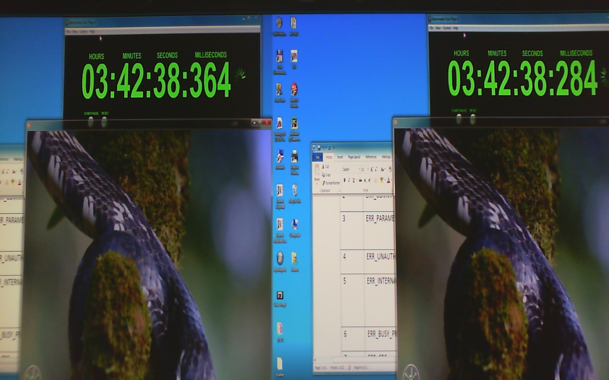
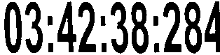

# automatic-latency-measure

Automatic Latency Measure in Video Encoder/Decoder
The need to have an automatic way to measure the latency has been more and more present in my project. Changing each configuration parameter, need to check every time the latency disruption, evaluating latency with different video modes 1920x1080-60p or 720p or 1080p30. Changing the content of the screen: video movie, Text editor …
 
## The manual way …
The manual way to measure the latency is to use the Picture in Picture feature available on some monitors, take a picture of the image before it enter into the device introducing the latency to measure…
                                                  

## The automatic way 
The automatic way is to have a camera in front of the Monitor and use it to capture a series of images and read the counters

 
Filter apply: Threshold 50% -> Black & White



Invert Black <-> white and crop into 2  separates counter
       
Then apply an OCR with a special configuration that only “digit” and “:” are part of the dictionary

`[ezerbib@localhost tiff]$     ../build/bin/tesseract  -psm 7 frame_003_1.png - digits`
00:04:23:2 38

`[ezerbib@localhost tiff]$     ../build/bin/tesseract  -psm 7 frame_003_2.png - digits`
00:04:231208

### Mixing all these action in a perl script
Using gstreamer to acquire raw image a convert them into “png” format.
 
 
Output of the perl program

```bash
[ezerbib@localhost tiff]$ ./latency.pl 
Setting pipeline to PAUSED ...
Pipeline is live and does not need PREROLL ...
Setting pipeline to PLAYING ...
New clock: GstSystemClock
Got EOS from element "pipeline0".
Execution ended after 0:00:15.656903788
Setting pipeline to PAUSED ...
Setting pipeline to READY ...
Setting pipeline to NULL ...
Freeing pipeline ...
lat: 0.050000
lat: 0.070000
lat: 0.060000
lat: 0.030000
…
lat: 0.100000
lat: 0.040000
AVG latency: 0.102016 64:[0.960000:0.020000]
```


at the end the program display yhe Average latency, the maximum and the minimum latency found

##
OCR is 
https://github.com/tesseract-ocr/tesseract


## Calibration
Use to compute the timer offset
```
[ezerbib@localhost tiff]$ DISPLAY=:0 gst-launch -v v4l2src   ! xvimagesink 
```
